# CSS Flex

[작성자: 노희재]

</br>
</br>
</br>

💡   Float 나 Inline-block 같은 방식보다 훨씬 간편하게 레이아웃을 배치 할 수 있는

 Flex 기능에 대해 자세히 알아보겠습니다.
 
 </br>
 </br>
 </br>

# Flex 와 Grid 의 차이
</br>

**Flex - 한 방향 레이아웃 시스템 (1차원)**

**Grid -  두 방향 레이아웃 시스템 (2차원)**
</br>
</br>

Grid 가 더 최신 기능이기 때문에 Flex 가 구시대 기술이 되어버렸다는 의견들도 있지만

Grid 로는 구현이 어려운 레이아웃이거나

Flex 를 쓰는게 더 편리한 경우가 있기 때문에 두가지 모두를 익히는 것이 좋습니다.

</br>
</br>

# Flex

</br>

Flex 의 속성들은

1. 컨테이너에 적용하는 속성
2. 아이템에 적용하는 속성

두가지로 나뉩니다.

</br>
</br>
</br>

### 1. 컨테이너에 적용하는 속성

</br>
</br>

- display: flex;

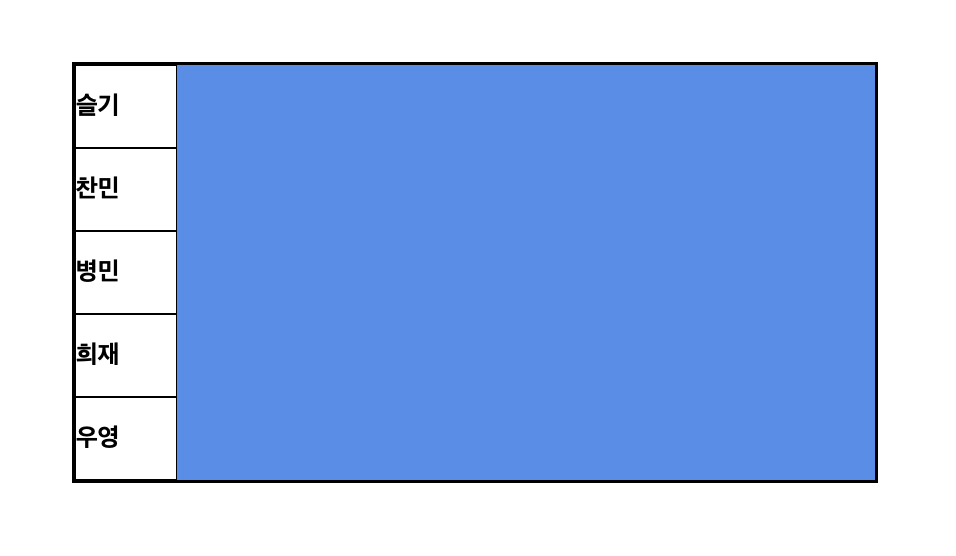

이런 식으로 배치되어 있는 레이아웃에

display: flex;

한 줄을 적용하면

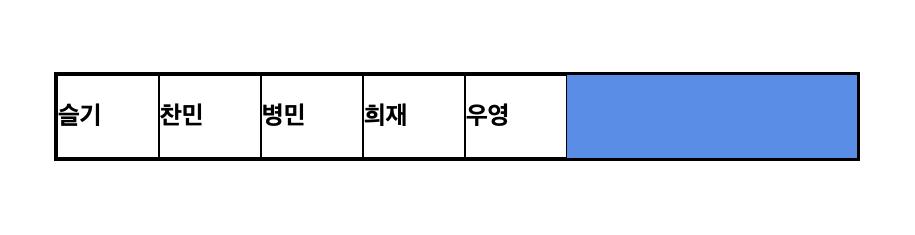

Flex 는 가로배치가 기본이므로 이렇게 가로로 배치됩니다.

여기서 container 에 height 를 지정해주고 item 에는 지정된 height 가 없다면?

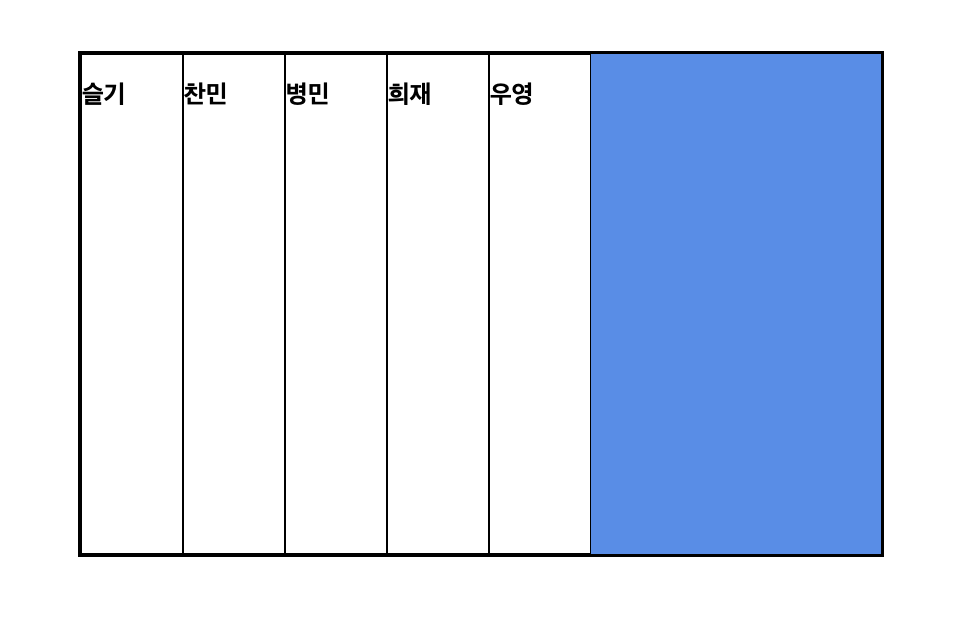

container 의 height 를 따라 item 의 height 도 늘어납니다.

</br>
</br>
</br>

- 배치 방향 설정

flex-direction: ;

아이템들이 배치되는 축의 방향을 결정하는 속성입니다.
</br>
</br>
</br>

| 가로 | row (기본값) | row-reverse |
| --- | --- | --- |
| 세로 | column | column-reverse |

</br>
</br>
</br>

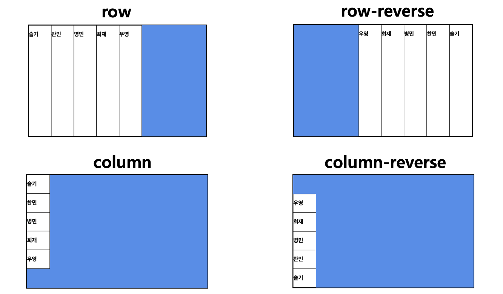

</br>
</br>
</br>

- 줄넘김 처리 설정

flex-wrap: ;

컨테이너에 아이템들을 한 줄에 담을 공간이 더는 없을 때

줄바꿈을 어떻게 할지 결정하는 속성입니다.

</br>

1. nowrap (기본값)

줄바꿈을 하지 않고, 넘치면 아이템이 삐져나갑니다.

</br>

2. wrap

줄바꿈을 합니다.

</br>

3. wrap-reverse

줄바꿈을 하며 아이템을 역순으로 배치합니다.

</br>

4. flex-flow

flex-direction 과 flex-wrap 을 한번에 지정할 수 있는 단축 속성으로,

flex-direction, flex-wrap 의 순으로 한 칸 떼고 써주면 됩니다.

ex) `flex-flow: row wrap;` 

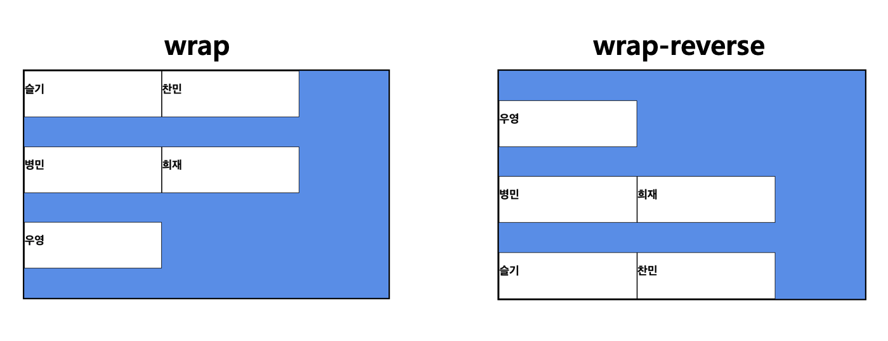

- 메인축 방향 정렬

justify-content: ;

메인축 방향으로 아이템들을 정렬하는 속성입니다.

</br>

1. flex-start (기본값)

시작점부터 아이템들을 정렬합니다.

row 배치일 때는 왼쪽, column 배치일 때는 위부터 배치됩니다.

</br>

2. flex-end

끝점부터 아이템들을 정렬합니다.

row 배치일 때는 오른쪽, column 배치일 때는 아래부터 배치됩니다.

</br>

3. center

아이템들을 가운데로 정렬합니다.

</br>

4. space-between

아이템들의 ‘사이에’ 균일한 간격을 만들어 줍니다.

</br>

5. space-around

아이템들의 ‘둘레에’ 균일한 간격을 만들어 줍니다.

</br>

6. space-evenly

아이템들의 ‘사이와 양 끝에’ 균일한 간격을 만들어 줍니다.

IE와 엣지(Edge)에서는 지원되지 않습니다.

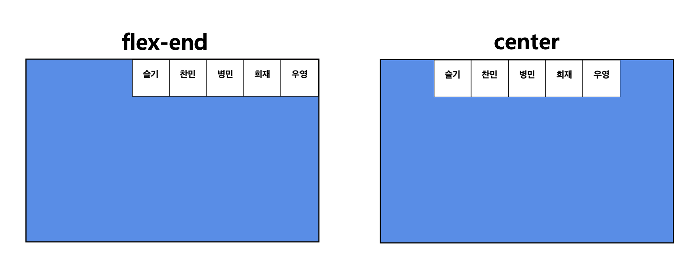

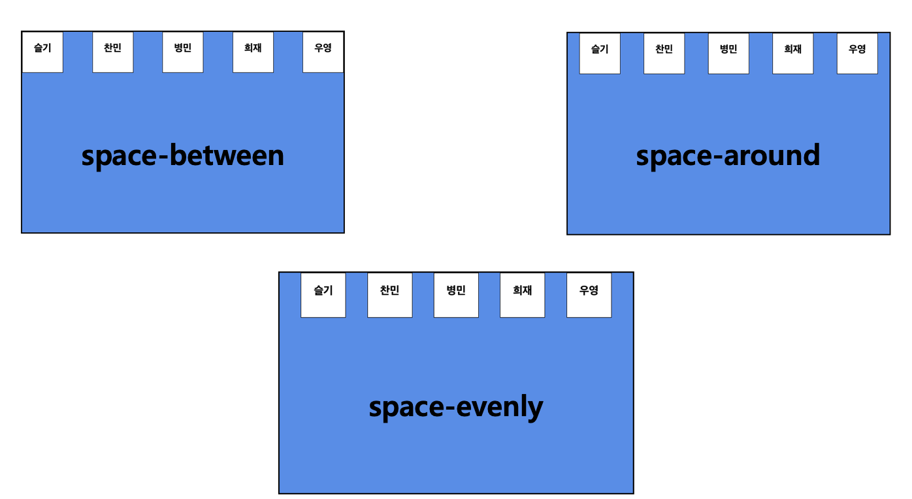

</br>

- 수직축 방향 정렬

align-items: ;

justify-content 의 수직 방향의 정렬을 설정하는 속성입니다.

</br>

1. stretch (기본값)

아이템들이 수직축 방향으로 끝까지 늘어납니다.

</br>

2. flex-start

아이템들을 시작점으로 정렬합니다.

row 배치일 때는 위, column 배치일 때는 왼쪽부터 배치됩니다.

</br>

3. flex-end

아이템들을 끝점으로 정렬합니다.

row 배치일 때는 아래, column 배치일 때는 오른쪽부터 배치됩니다.

</br>

4. center

아이템들을 가운데로 정렬합니다.

</br>

5. baseline

아이템들을 텍스트 베이스라인 기준을 정렬합니다.

</br>

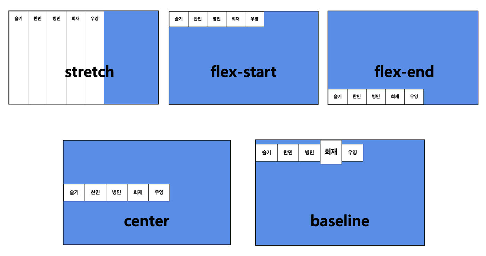

</br>
</br>

그래서,

justify-content: center;

align-item: center;

를 해주면 아이템을 가운데에 배치시키는 것도 굉장히 쉽습니다.

</br>

짠!

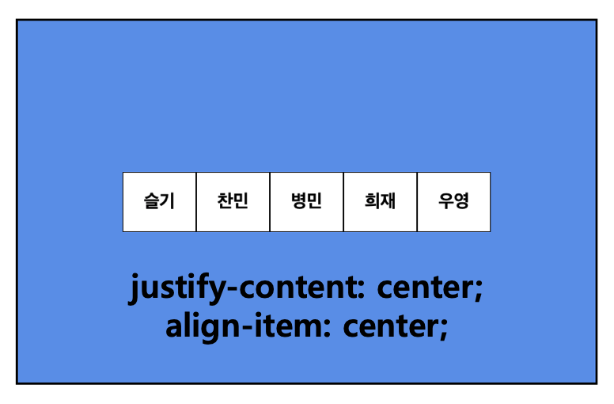
</br>
</br>
</br>

### 2. 컨테이너에 적용하는 속성
</br>

- 기본 영역

flex-basis: ;

Flex 아이템의 기본 크기를 설정합니다.

flex-direction이 row 일 때는 너비, column 일 때는 높이를 설정합니다.

</br>

1. auto (기본값)

해당 아이템의 width 값을 사용합니다.

width 값이 없다면 컨텐츠의 크기를 사용합니다.

</br>

2. 0; %; px, rem 단위

각종 단위의 수로 설정 할 수 있습니다.

</br>

3. content

컨텐츠의 크기로 설정하는 것으로,

width 를 따로 설정하지 않은 경우와 같습니다.

</br>
</br>
</br>

- 유연하게 늘리기

flex-grow: ;

flex-basis: ; 의 값보다 커질 수 있는지 결정하는 속성입니다.

flex-grow 에는 숫자값이 들어가는데, 몇이든 0보다 큰 값이 셋팅된다면

해당 아이템이 Flexible 박스로 변하고

원래의 크기보다 커져서 빈 공간을 메우게 됩니다.

기본값이 0 이기 때문에 따로 셋팅하기 전까지는 아이템이 늘어나지 않습니다.

여기서 숫자의 의미는 아이템들의 flex-basis 를 제외한 여백 부분을

flex-grow 에 지정된 숫자의 비율로 나누어 가진다고 생각하면 됩니다.

</br>
</br>

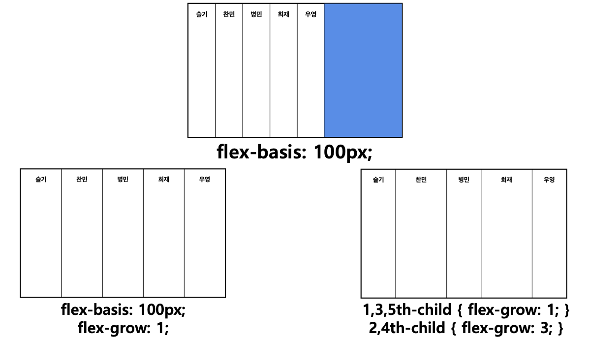

</br>
</br>

- 유연하게 줄이기

flex-shrink: ;

flex-basis: ; 의 값보다 작아질 수 있는지 결정하는 속성입니다.

flex-shrink 에는 숫자값이 들어가는데, 몇이든 0보다 큰 값이 셋팅된다면

해당 아이템이 Flexible 박스로 변하고 원래의 flex-basis 보다 작아집니다.

기본값이 1 이기 때문에 따로 셋팅하지 않아도 아이템이 flex-basis 보다 작아질 수 있습니다.

</br>
</br>

```css
.item:nth-child(1) {
            flex-grow: 1;
}

.item:nth-child(2) {
            flex-shrink: 0;
            width: 100px;
}
```

</br>

그래서 위와 같은 셋팅을 적용하게 되면,

</br>
</br>

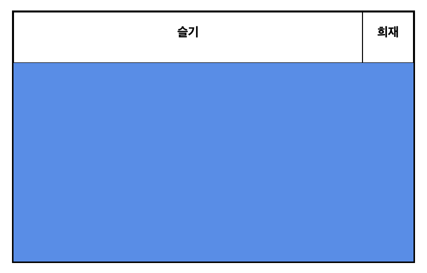

</br>

이렇게 두번째 아이템은 flex-shrink 가 0 이므로

100px 로 사이즈가 고정되고

첫번쨰 아이템은 flex-grow 가 1의 값을 가지므로

남은 영역을 모두 채우게 됩니다.

웹페이지의 사이즈를 아무리 줄여도

</br>

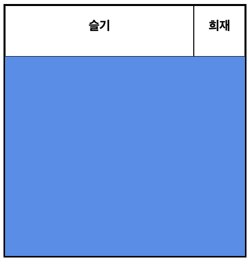

</br>

이와 같이 100px 은 고정적이고

flex-grow: 1; 의 값을 갖는 아이템이 유동적으로 남은 영역을 채우게 됩니다.

</br>
</br>
</br>

- flex

flex-grow, flex-shrink, flex-basis 를 한 번에 쓸 수 있는 축약형 속성입니다.

이 세 속성들은 서로 관련이 깊기 때문에, 이 축약형을 쓰는 쪽이 편리합니다.

</br>
</br>

```css

	flex: 1;
	/* flex-grow: 1; flex-shrink: 1; flex-basis: 0%; */

	flex: 1 1 auto;
	/* flex-grow: 1; flex-shrink: 1; flex-basis: auto; */

	flex: 1 500px;
	/* flex-grow: 1; flex-shrink: 1; flex-basis: 500px; */
```

</br>

위와 같이 축약하여 사용합니다.

참고할 점은, flex: 1; 처럼 flex-basis 를 생략하면 flex-basis의 값은 0이 됩니다.

</br>
</br>
</br>
