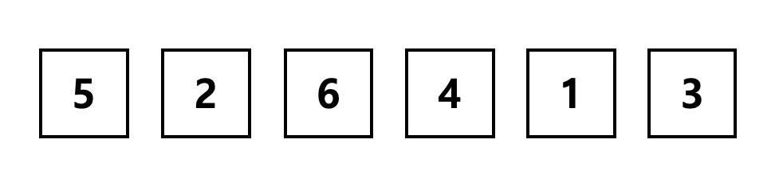
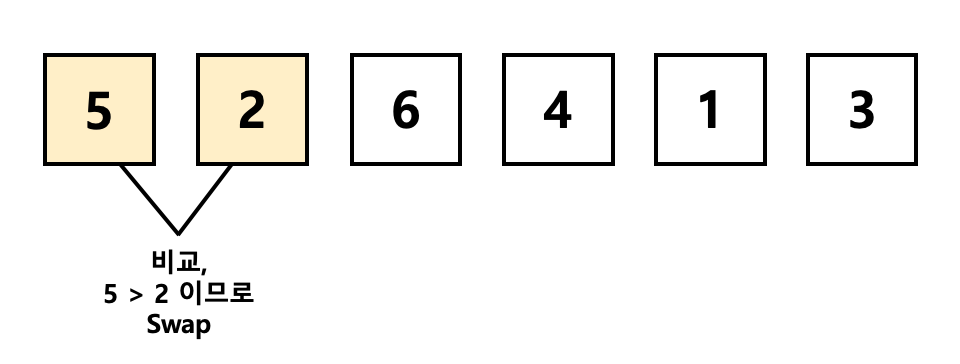
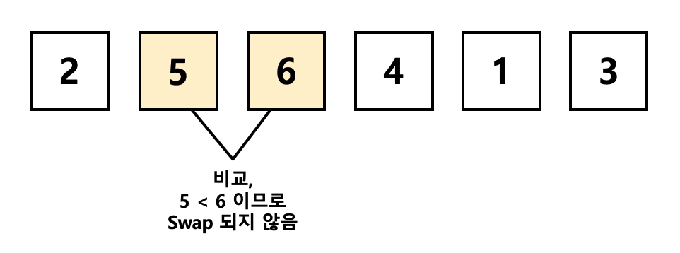
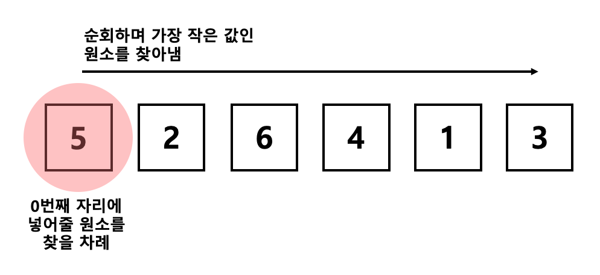
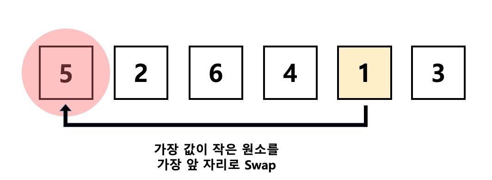
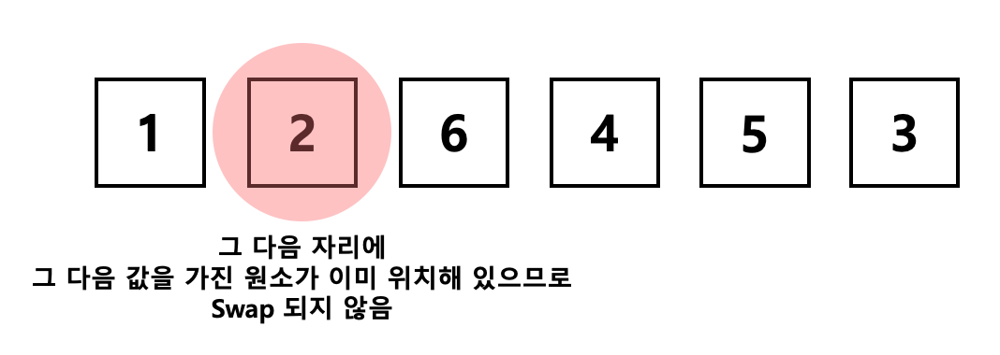
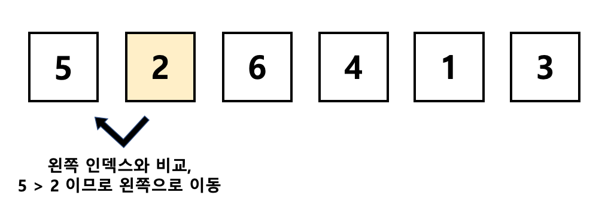
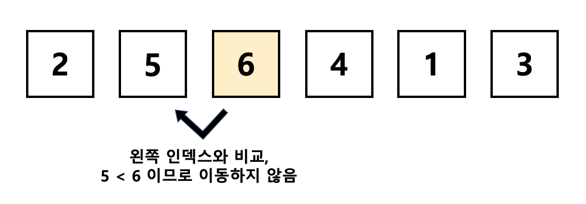

# Sorting

[작성자: 노희재]

</br>
</br>

💡  알고리즘 문제에서 정렬 알고리즘은 기본이 되는 부분으로,

많은 알고리즘 문제들이 정렬 알고리즘을 써야만 해결이 된다고 합니다.

그중 쉬운편에 속하는 세가지를 다뤄보겠습니다.
</br>
</br>

# 1. 버블 정렬 (Bubble Sort)

 

버블 정렬은 인접한 두 원소를 검사하여 정렬하는 방법입니다.

시간 복잡도가 O(n^2) 으로 상당히 느리지만, 데이터가 적을 때에 쓰입니다.
</br>
</br>

원소의 이동이 거품이 수면으로 올라오는 듯한 모습을 보이기 때문에

Bubble Sort 라는 이름이 지어졌다고 합니다. (gif 참고 👇 )
</br>
</br>


</br>
</br>
</br>
이런 배열이 있다고 가정하고 시작하겠습니다.



</br>
</br>
가장 앞에 있는 두 원소를 비교하고,

5가 2보다 더 크므로 두 원소의 자리를 바꿔줍니다.



</br>
</br>
</br>
그리고 바꾼 위치에서 그 옆 원소인 6과 비교합니다.

이번엔 5가 6보다 작네요? 자리를 바꾸지 않고 그대로 둡니다.

그 다음엔 6과 4를 비교하고, 자리를 바꾸고

6과 1을 비교하여 자리를 ~~......



</br>
이런식으로 반복하여 가장 큰 값을 끝으로 보내는 방식입니다.

다시 처음으로 돌아가 그 다음 큰 값이 자리에 올 때까지
for 문을 반복하여 순서대로 정렬합니다.
</br>
</br>
</br>

### 1-1. 코드 구현
</br>

다음은 버블 정렬의 코드입니다.
</br>

```jsx
let arr = [5, 2, 6, 4, 1, 3];

const bubble = (arr, size) => {
    for (let i = size - 1; i > 0; i--) {
        for (let j = 0; j < i; j++) {
            if (arr[j] > arr[j + 1]) {
                let swap = arr[j];
                arr[j] = arr[j + 1];
                arr[j + 1] = swap;
            }
        }
    }
    return arr;
}

console.log(bubble(arr, arr.length));

// [ 1, 2, 3, 4, 5, 6 ]
```
</br>
</br>

### 1-2. 시간복잡도

- **Worst Case: O(n^2)**: 정렬이 하나도 안되어있는 경우
- **Best Case: O(n)**: 이미 정렬이 되어있는 경우

</br>
버블 정렬은 최악의 경우 O(n^2)의 시간 복잡도를 가집니다.
</br>
각 자리를 찾기 위해 n번의 순회를 해야하며</br>
n번의 회전 동안에 요소의 개수만큼 또 순회를 해야하기 때문입니다.</br>
그러나 이미 정렬이 되어있는 경우에는 한 번의 순회로 정렬 여부를 알 수 있습니다.
</br>
</br>
(but, 우리에게 주어지는 알고리즘 문제에서</br>
이미 알맞게 정렬이 되어있는 경우는 없을테니 우리에게 Best Case 는 없겠죠?</br>
그래서 제가 구현해둔 코드에 break 문은 없습니다,,🙃 )
</br>
</br>
</br>

# 2. 선택 정렬 (Selection Sort)

선택 정렬은 제자리 정렬 알고리즘 중 하나입니다.

알고리즘이 단순하며, 사용할 수 있는 메모리가 제한적일 경우 용이합니다.

</br>
</br>
</br>

마찬가지로 같은 배열을 두고 시작하겠습니다.


</br>
</br>
0번째 자리에 원소를 넣어줄 차례라면,

모든 원소를 순회하며 가장 작은 값을 가진 원소부터 찾아냅니다.



</br>
</br>
가장 값이 작은 원소를 찾았습니다!

가장 앞 자리로 위치를 바꿔줍니다.



</br>
</br>
1번째 자리에 원소를 넣어줄 차례인데,

이미 그에 맞는 원소가 위치해 있으므로

이번엔 Swap 되지 않습니다.



</br>
이런식으로 n번째 작은 값을 가진 원소를 찾아내며

순서대로 배열의 위치가 바뀔 때까지 for 문을 반복합니다.
</br>
</br>
</br>

### 2-1. 코드 구현
</br>
다음은 선택 정렬의 코드입니다.
</br>
</br>

```jsx
let arr = [5, 2, 6, 4, 1, 3];

const selection = (arr) =>
    for (let i = 0; i < arr.length; i++) {
        let minIndex = i;
        for (let j = i + 1; j < arr.length; j++) {
            if (arr[minIndex] > arr[j]) {
                minIndex = j;
            }
        }
        if (minIndex !== i) {
            let swap = arr[minIndex];
            arr[minIndex] = arr[i];
            arr[i] = swap;
        }
    }
    return arr;
}

console.log(selection(arr));

// [ 1, 2, 3, 4, 5, 6 ]
```

</br>
</br>

### 2-2. 시간복잡도

- **Worst Case: O(n^2)**: 정렬이 하나도 안되어있는 경우
- **Best Case: O(n^2)**: 이미 정렬이 되어있는 경우
</br>

선택 정렬은 이미 정렬이 되어있는 경우에도 O(n^2)의 시간 복잡도를 가집니다.

매번 정해진 자리에 올 수 있는 최소값을 찾아야하기 때문입니다.

그렇기 때문에 성능이 매우 떨어집니다.
</br>
</br>
</br>

# 3. 삽입 정렬 (Insertion Sort)

삽입 정렬은 데이터가 많을수록 효율이 떨어지지만 구현이 간단하다는 장점이 있습니다.

</br>
</br>
</br>

이번에도 마찬가지로 같은 배열을 두고 시작하지만,

삽입 정렬은 0번째 인덱스가 아닌 1번째 인덱스부터 시작합니다.


</br>
</br>
왼쪽 인덱스와 비교 했을 때 값이 작다면

현재 인덱스를 왼쪽으로 Swap 시킵니다.



</br>
</br>
그 다음 인덱스에선 교체할 필요가 없네요!

이동하지 않고 그대로 둡니다.



</br>
그럼 그 다음 순서인 3번째 인덱스에 위치한 값인 ‘4’ 는

6과 자리를 바꾸고 연속으로 5와 자리를 또 바꾸겠죠?

이런식으로 왼쪽에 현재 인덱스보다 작은 값이 있지 않을 때까지

for 문과 while 문을 반복하며 Swap 시켜줍니다.
</br>
</br>
</br>

### 3-1.  코드 구현
</br>
다음은 삽입 정렬의 코드입니다.
</br>
</br>

```jsx
let arr = [5, 2, 6, 4, 1, 3];

const insertion = (arr) => {
    for (let i = 1; i < arr.length; i++) {
        let cur = arr[i];
        let left = i - 1;

        while (left >= 0 && arr[left] > cur) {
            arr[left + 1] = arr[left];
            left--;
        }
				arr[left + 1] = cur;
    }
    return arr;
}

console.log(insertion(arr));

// [ 1, 2, 3, 4, 5, 6 ]
```

</br>
</br>

### 3-2. 시간복잡도

- **Worst Case: O(n^2)**: 정렬이 하나도 안되어있는 경우
- **Best Case: O(n)**: 이미 정렬이 되어있는 경우
</br>

삽입 정렬은 버블 정렬과 똑같은 시간복잡도를 가지지만

필요한 데이터만 스캔하기 때문에 위의 두가지 방식보다 빠르다는 장점을 가집니다.
</br>
</br>
</br>

### ???? 시간복잡도는 다 거기서 거긴데 뭐가 빠르단거죠?

사실 최악, 최고의 경우는 자주 발생하지 않기 때문에

시간복잡도는 Worst 와 Bset 보단 Average 를 보는 것이 좀 더 옳다고 합니다.

결론적으론 때에 따라 다를 수 있지만,

삽입 > 선택 > 버블 순으로 낫다고 볼 수 있을 것 같습니다!

</br>
</br>
